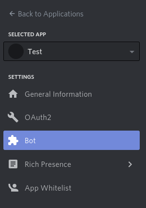
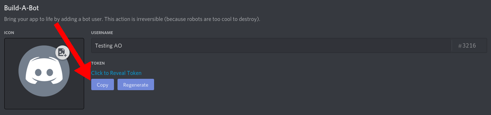
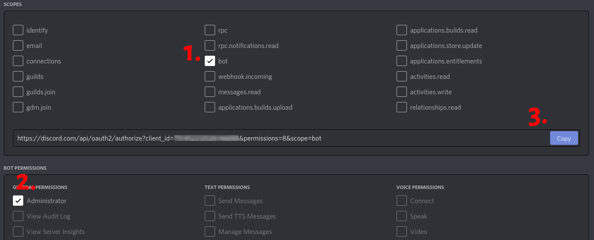
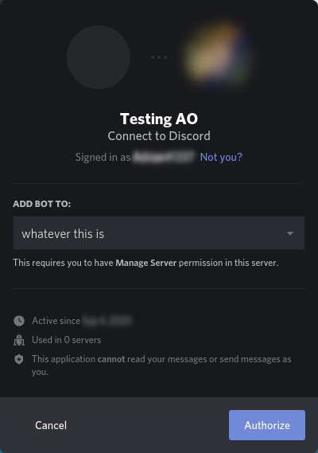
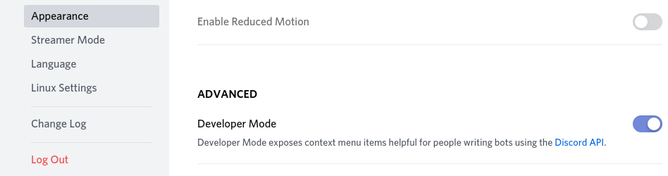

[](https://quay.io/repository/nadyita/nadybot)

# Nadybot #

Nadybot is the next-generation chatbot for Anarchy Online.

## Support & Bug Reports ##

For all support questions and bug reports please contact me in-game (Nadychat) or via email nadyita@hodorraid.org.

## Installation ##

There are three ways that you can obtain Nadybot:
* Release Archives (recommended for most users)
* Latest Development
* Cloning the Repository (recommended for developers).

### Release Archives ###

You can download the latest stable version from link below. If you want the most stable version, choose the latest GA release.  If you want to test some of the newest features, choose an RC release.

<https://github.com/Nadybot/Nadybot/releases>

### Latest Development ###

You can download the very latest unstable or stable version from the link below. Note that this version is a development version, may not have been tested thoroughly, and may contain bugs.

* <https://github.com/Nadybot/Nadybot/archive/unstable.zip>
* <https://github.com/Nadybot/Nadybot/archive/stable.zip>

### Cloning The Repository ###

Alternatively you can clone the Nadybot git repository. The advantage to doing this is that as new changes are committed you can simply do `git pull` to pull those changes into your copy. Note that this version is a development version, may not have been tested thoroughly, and may contain bugs. If you are planning on developing on Nadybot, we recommend that you use this method.
Pay attention that there is no "master" branch, but "stable" and "unstable"

<https://github.com/Nadybot/Nadybot.git>

## Running Nadybot ##

### Regular setup ###

Before you are able to run the bot, you need to install the required composer packages:

```bash
composer install --no-dev
composer dumpautoload --no-dev
```

To start the bot, run the ```chatbot.bat``` file (on linux run the ```chatbot.sh``` file). If it is your first time running the bot, it will take you through the configuration wizard to configure the bot. You will need to have a character name that you you want to run the bot as along with the username and password for the account that has that character. If you want to run this bot as an org bot, you will also need the EXACT org name of the org and the character that the bot runs as will need to have already been invited to the org.

### With Docker ###

You can either use the already pre-made Docker images that I provide at <https://quay.io/repository/nadyita/nadybot> or you can build it yourself. To use the pre-made images, address them as `quay.io/nadyita/nadybot`

In order to build the Docker image, issue

```shell
docker build -t nadybot .
```

Either way, you can then run the bot in test-mode like this:

```shell
docker run \
    --rm \
    -it \
    -e CONFIG_LOGIN=myaccount \
    -e CONFIG_PASSWORD=mypassword \
    -e CONFIG_BOTNAME=Mybot \
    -e CONFIG_SUPERADMIN=Myplayer \
    -e CONFIG_DB_TYPE=sqlite \
    -e CONFIG_DB_NAME=testdb \
    -e CONFIG_DB_HOST=/tmp \
    quay.io/nadyita/nadybot
```

The database in this approach will be fresh on every start and you will expose your bot's password in the process list. Only use this for testing!

A systemd service for this type of configuration, using MariaDB in another docker container as database could look like this:

```ini
[Unit]
Description=My Cool Bot
Requires=docker.service
Requires=mariadb.service
After=docker.service

[Service]
Type=simple
ExecStartPre=-/usr/bin/docker stop "%n"
ExecStartPre=-/usr/bin/docker rm -f "%n"
ExecStart=/usr/bin/docker run \
    --rm \
    --name "%n" \
    --env-file /etc/sysconfig/mycoolbot \
    --link mariadb.service:mariadb \
    quay.io/nadyita/nadybot
ExecStop=-/usr/bin/docker stop "%n"
ExecReload=/usr/bin/docker stop "%n"
Restart=always
RestartSec=5

[Install]
WantedBy=multi-user.target
```

and the corresponding configuration file in `/etc/sysconfig/mycoolbot`:

```ini
CONFIG_LOGIN=myaccountname
CONFIG_PASSWORD=mypassword
CONFIG_ORG=Myorg
CONFIG_SUPERADMIN=Mychar
CONFIG_BOTNAME=Mycoolbot
CONFIG_DIMENSION=5
CONFIG_DB_TYPE=mysql
CONFIG_DB_HOST=mariadb
CONFIG_DB_NAME=my_db_name
CONFIG_DB_USER=my_db_username
CONFIG_DB_PASS=my_db_pass_for_dbuser
#CONFIG_AMQP_SERVER=127.0.0.1
#CONFIG_AMQP_USER=guest
#CONFIG_AMQP_PASSWORD=guest
```

This prevents passwords from showing up anywhere in the process list, but make sure you set the permissions of this file to `0600`, so no one except root can see your password.

### Developing with Containers ###

Developing the bot using Containers (Docker, Podman, etc.) is very easy. You basically run the container and mount your local checkout over `/nadybot`.

You don't need php or composer installed for this setup since the docker image will already contain everything you need to get started.

#### Docker ####

```shell
docker run \
    --rm \
    -it \
    -v "$(pwd)":/nadybot \
    -e CONFIG_LOGIN=myaccount \
    -e CONFIG_PASSWORD=mypassword \
    -e CONFIG_BOTNAME=Mybot \
    -e CONFIG_SUPERADMIN=Myplayer \
    -e CONFIG_DB_TYPE=sqlite \
    -e CONFIG_DB_NAME=testdb \
    -e CONFIG_DB_HOST=/tmp \
    quay.io/nadyita/nadybot
```

#### Rootless Podman #####

```shell
podman run \
    --user root \
    --security-opt label=disable \
    -v "$(pwd)":/nadybot \
    --rm \
    -it \
    -e CONFIG_LOGIN=myaccount \
    -e CONFIG_PASSWORD=mypassword \
    -e CONFIG_BOTNAME=Mybot \
    -e CONFIG_SUPERADMIN=Myplayer \
    -e CONFIG_DB_TYPE=sqlite \
    -e CONFIG_DB_NAME=testdb \
    -e CONFIG_DB_HOST=/tmp \
    quay.io/nadyita/nadybot
```

## Relays between orgs ##

In order to relay messages between orgs, you will need 1 bot in each org configured in the same way.

There are 3 ways to link the org chats together:

### tell-relay between 2 bots ###

Pro:

* simplest solution, no additional bot or software required

Contra:

* Old Budabot versions only support links between 2 orgs
* Tell-relays suffer from the heavy rate-limiting imposed on tells

In order to configure a tell relay between bot `Alice` in org `The First Ones` and bot `Bobby` in the org `We can read you`, which will relay **all** messages without any prefix whatsoever between the 2 orgs, you need to do the following on `Alice`:

```text
!config mod RELAY_MODULE enable all
!settings save relaytype 1
!settings save relaybot Bobby
!settings save relay_guild_abbreviation 1st
```

and the following on `Bobby`:

```text
!config mod RELAY_MODULE enable all
!settings save relaytype 1
!settings save relaybot Alice
!settings save relay_guild_abbreviation read
```

This will then bridge org and private chat of both orgs together. The result looks like this:

```ini
[The First Ones] Tester: Testing 123...
[We can read you] Bobby: [1st] Tester: Testing 123

[We can read you] Tester2: Replying 123
[The First Ones] Alice: [read] Tester2: Replying 123...
```

Notice how the name of the orgs are abbreviated as configured in the `relay_guild_abbreviation` setting.

### private-channel-relay between X bots ###

Pro:

* Can link a sheer endless amount of bots/orgs together
* No external program needed
* Access control to the relay is inside Anarchy Online on the dedicated bot

Contra:

* Requires a dedicated bot for providing the private channel used as a relay
* If a bot restarts, the messages sent while it was down are not relayed retroactively

In order to configure a private-channel-relay between bot `Alice` in org `The First Ones` and bot `Bobby` in the org `We can read you`, which will relay **all** messages without any prefix whatsoever between the 2 orgs, we will first need to setup the bot `Relayer`, providing the dedicated private channel. 

```text
!config mod PRIVATE_CHANNEL_MODULE enable all
!adduser Alice
!adduser Bobby
```

Once the `Relayer` has been setup, they will auto-invite `Alice` and `Bobby`, but for now they won't join until we configure them to.

`Alice`'s configuration looks like this:

```text
!config mod RELAY_MODULE enable all
!settings save relaytype 2
!settings save relaybot Relayer
!settings save relay_guild_abbreviation 1st
```

`Bobby`'s configuration looks like this:

```text
!config mod RELAY_MODULE enable all
!settings save relaytype 2
!settings save relaybot Relayer
!settings save relay_guild_abbreviation read
```

Notice how they are identical except for the `relay_guild_abbreviation`. If you then either restart `Alice` and `Bobby` or `!invite` them again on the `Relayer`, they will start relaying messages.

### AMQP-relay between X bots ###

Pro:

* Can link an endless amount of bots/orgs together with literally no delay
* Multiple relay networks can be managed simultaneously
* Messages are kept between bot restarts, configurable on the AMQP server
* Allows to link non-AO-bots to the  network as well

Contra:

* Access control to the relay is outside Anarchy Online on the AMQP server
* Requires a dedicated AMQP server

In order to configure a private-channel-relay between bot `Alice` in org `The First Ones` and bot `Bobby` in the org `We can read you`, which will relay **all** messages without any prefix whatsoever between the 2 orgs, we will first need to setup the AMQP server. If you don't know what this actually is, don't do it. Period.

We start by creating 2 users, each with a unique username and password. For simplicity, we are also assuming that you are using RabbitMQ, but any AMQP server will work.

```console
rabbitmq@host:~$ rabbitmqctl add_vhost /my_relay
Adding vhost "/my_relay" ...

rabbitmq@host:~$ rabbitmqctl add_user alice
Adding user "alice" ...
Password: ******

rabbitmq@host:~$ rabbitmqctl set_permissions --vhost /my_relay alice nadybot nadybot nadybot
Setting permissions for user "alice" in vhost "/my_relay" ...

rabbitmq@host:~$ rabbitmqctl add_user bobby
Adding user "alice" ...
Password: ******

rabbitmq@host:~$ rabbitmqctl set_permissions --vhost /my_relay bob nadybot nadybot nadybot
Setting permissions for user "bob" in vhost "/my_relay" ...
```

Now you will need to change the bots' configuration to connect to the AMQP server using your vhost `/my_relay`:

```php
  $vars['amqp_server'] = "your server";
  $vars['amqp_port'] = 5672;
  $vars['amqp_user'] = "alice/bobby";
  $vars['amqp_password'] = "your password";
  $vars['amqp_vhost'] = "/my_relay";
```

Restart the bots and check the logs if the connection is established. Now it's time to make your bots use this conection:

`Alice`'s configuration looks like this:

```text
!config mod RELAY_MODULE enable all
!settings save relaytype 3
!settings save relaybot nadybot
!settings save relay_guild_abbreviation 1st
```

`Bobby`'s configuration looks like this:

```text
!config mod RELAY_MODULE enable all
!settings save relaytype 3
!settings save relaybot nadybot
!settings save relay_guild_abbreviation read
```

Notice how they are identical except for the `relay_guild_abbreviation`. Relaying should start immediately after changing the settings.

The value for `relaybot` has to mimic the AMQP exchange you want your network to use.

## Relay with Discord ##

Nadybot can interact with Discord in 2 ways:

* Send notifications into a configured channel
* Relay messages and commands between a Discord channel and the org and/org private channel of the bot

Both require a working and registered bot in Discord and an authentication token. For relaying, you also need a permanent connection to the discord gateway which is provided by the `DISCORD_GATEWAY_MODULE`.

### Acquiring a token for your Discord bot ##

In order to interact with Discord, you will need a bot account to communicate and log in.

To create one, follow the following steps:

1. Go to the [Discord developer application page](https://discord.com/developers/applications) and login if you haven't already.

2. Click the blue "New Application" button in the top right corner and give it a fancy name (by default this will match the name in Discord later)<br/>


3. Click "Bot" in the tab to the left and then "Add Bot" to the right. Confirm the selection.

4. (Optional) Upload a fancy avatar or change the nickname of the bot.

5. Click "Copy" on the "Token" section to get it into your clipboard.<br/>


6. Configure your bot to use the token with `!settings save discord_bot_token your_copied_token`<br/>
It will instantly try and validate if this is a valid token.

7. Go to the "OAuth2" tab to the left and tick the box with "Bot", select "Administrator" in the new box below, then hit the "Copy" button<br/>


8. Paste it in a new browser tab and select your Org's Discord server (you will need Admin permissions there). Click "Authorize" and you're done.<br/>


9. Turn on your Discord modules with<br/>
`!config mod DISCORD enable all`<br/>
`!config mod DISCORD_GATEWAY_MODULE enable all`

The token you copied will be used to log in as the bot. If you watch your bot's log, it should now show you that the Gateway module logs into the gateway and starts receiving events.

### Configuring notifications ###

Once you have your Discord access token setup, it is time to choose which Discord channels the bot will use. There's 2 different channels:

* One channel for receiving notifications
* One channel for relaying into

Both channels can be the same, but you have the choice to use separate ones.

First of all, enable the Developer Mode in Discord, so you are able to copy & paste channel IDs, which is needed now.

Go to your user settings, choose "Appearance" and scroll all the way down to Developer mode



Activate it and leave user configuration. From now on, when right clicking on any Discord channel, you get the choice to "Copy ID".

Get the channel id of the channel you want your bot to send notifications into and save it with `!settings save discord_notify_channel your_copied_channel_id`

This, again, will be validated immediately. If your Discord bot does not have access to the channel, you should see an error message, disallowing you to pick that channel.

### Configuring the Discord relay ###

First, you have to pick the channel to relay into. Do this by issuing a `!discord relay`. You should see a choice list of all channels known to your bot. Pick one.

Next, send a `!config DISCORD_GATEWAY_MODULE` and configure what and when to relay as well as colors to your liking. The bot should start relaying instantly.

### Calling bot commands ###

In order to call any commands on the bot from Discord, you must "link" a Discord user and an AO bot user. This works by requesting to be linked to an AO user from Discord and accepting the link on AO-side.

You do this by sending a `!extauth request Nadyita` from Discord to the bot in a direct message if you want to link your current Discord user to the AO character "Nadyita". Obviously, change "Nadyita" to whatever your AO character is.

Your AO character should have received a message from the bot to either accept or reject the link. Keep in mind that linking these will grant your Discord user essentially the same rights as your AO user. Once connected, you can use commands prefixed by whatever prefix you set from the Discord channel you relay into or with private messages.